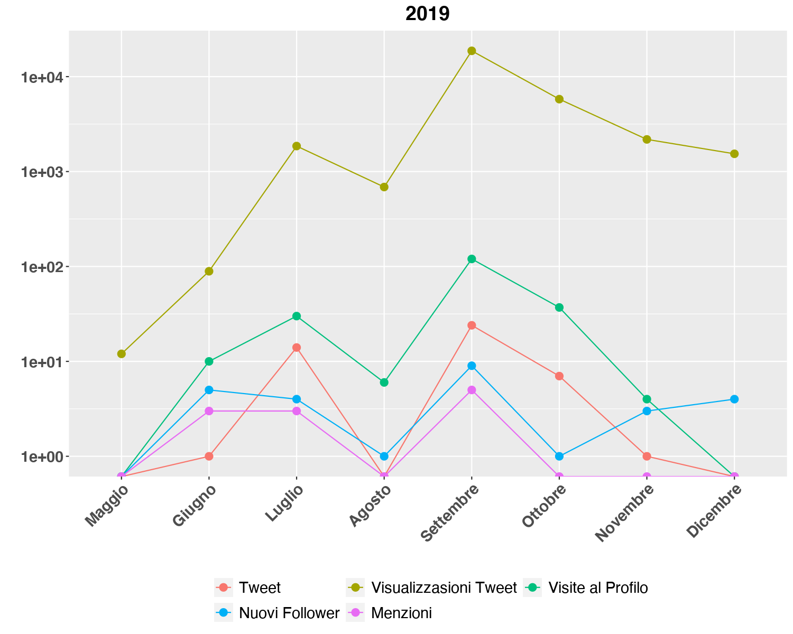
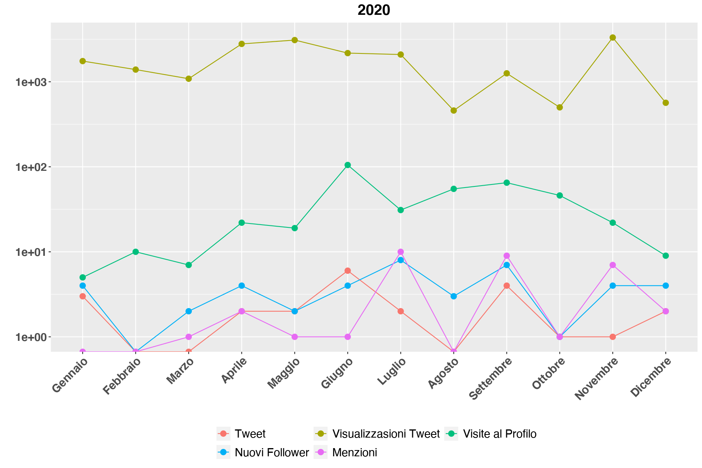

# Statistiche di utilizzo dell'account Twitter dell'Istituto Di Biomembrane Bioenergetica e Biotecnologie Molecolari del CNR
L'Istituto Di Biomembrane Bioenergetica e Biotecnologie Molecolari del CNR (IBIOM-CNR) per l'outreach delle sue attività di ricerca si è dotato di un account twitter da ***Maggio 2019***.  
L'account è [@CNR_IBIOM](https://twitter.com/CNR_IBIOM).  
Di seguito sono riportate le statistiche di accesso per gli anni 2019 e 2020.  

# 2019
Di segutio le statistiche per l'anno 2019.  

|Mese|Tweet|Visualizzasioni Tweet|Visite al Profilo|Nuovi Follower|Menzioni|
|:-|:-|:-|:-|:-|:-|
|Maggio|0|12|0|0|0|
|Giugno|1|89|10|5|3|
|Luglio|14|1856|30|4|3|
|Agosto|0|687|6|1|0|
|Settembre|24|18700|120|9|5|
|Ottobre|7|5791|37|1|0|
|Novembre|1|2181|4|3|0|
|Dicembre|0|1538|0|4|0|

# 2020
Di segutio le statistiche per l'anno 2020.  

|Mese|Tweet|Visualizzasioni Tweet|Visite al Profilo|Nuovi Follower|Menzioni|
|:-|:-|:-|:-|:-|:-|
|Gennaio|3|1751|5|4|0|
|Febbraio|0|1391|10|0|0|
|Marzo|0|1086|7|2|1|
|Aprile|2|2789|22|4|2|
|Maggio|2|3094|19|2|1|
|Giugno|6|2174|105|4|1|
|Luglio|2|2092|31|8|10|
|Agosto|0|459|55|3|0|
|Settembre|4|1257|65|7|9|
|Ottobre|1|500|46|1|1|
|Novembre|1|3315|22|4|7|
|Dicembre|2|566|9|4|2|

